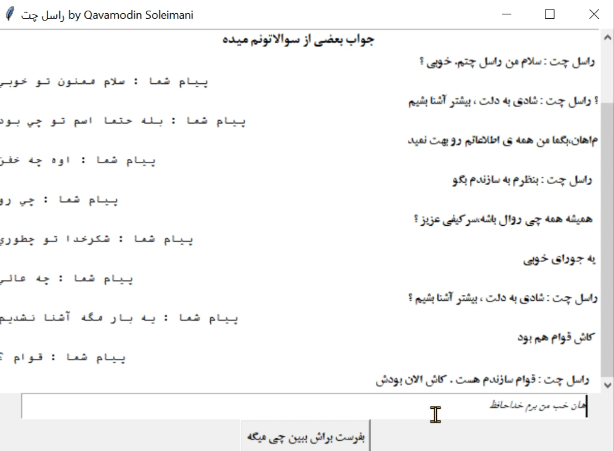

# راسل چت

با این ربات میتونید چتی کوتاه و ساده ای داشته باشید

***پروژه مربوط به درس اول هوش مصنوعی در کتاب راسل است*** 
# توضیحات

در این پروژه با استفاده از الگوریتم های ساده که به وضوح در ویدئوی پروژه شرح داده شده ، یک ربات طراحی شده که به پیام های شما پاسخ های تعیین شده از گذشته را میدهد. درصورتی که زمان بیشتری برای این پروژه داده میشد امکان تکمیل آن وجود داشت .

الگوریتم کلی به این صورت است که اگر کلمات کلیدی توسط کاربر وارد شد باید از جواب های پیش فرض در مورد آن کلمه داده شود در غیر اینصورت جواب های بیطرف و روزمره به کار برود که از nans با استفاده از مقدار G_var مشخص میشود که کی باید سراغ جواب های بی طرف در لیست nans برود

برای عدم تکراری شدن و اصطلاحا ignore کردن جواب کاربر ، هر عبارت که از nans استفاده شود آن عبارت دیگر استفاده نمیشود و زمانی که همه ی آنها تمام شد ، پیام اتمام شارژ داده میشود.

## تصویر

## ویدئو

https://user-images.githubusercontent.com/60060223/161401380-ae159523-e97f-4638-a5b7-fd4f65fb8c68.mp4

